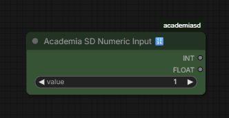
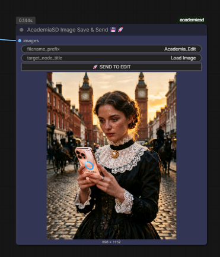

# comfyui_AcademiaSD
# Academia SD Custom Nodes for ComfyUI

A collection of custom nodes designed for **Academia SD**, created to optimize workflows, save downloading time, and improve the user experience (UX) in ComfyUI while maintaining 100% native compatibility.

ComfyUI and ForgeWebUI tutorial in my Youtube channel [@Academia SD](https://www.youtube.com/@Academia_SD)

---

## ⬇️ Academia SD Automatic Downloader v0.99

A smart download manager integrated directly into the ComfyUI canvas.
*   **Multi-Link Support:** Paste links from Civitai or HuggingFace repositories.
*   **Automatic HF Detection:** When pasting a HuggingFace repo link, it automatically displays a dropdown list to choose the exact version (e.g., quantized `.gguf` files).
*   **Cache & Security:** Non-blocking UI. It manages Civitai and HuggingFace tokens to download NSFW or private models, and displays real-time MB/GB weight with progress bars.
*   **Smart Path Management:** Detects your secondary paths in `extra_model_paths.yaml` (e.g., Automatic1111) to avoid downloading the same model twice.

---

## 💊 Academia SD Multi-LoRA v0.8

Load multiple LoRAs in a hyper-compact space without cluttering your workflow with dozens of chained nodes.
*   **Global & Individual Toggles:** Enable or disable LoRAs with a single click for quick testing without disconnecting cables.
*   **On-the-fly Metadata:** Hover your mouse over a LoRA in the menu and a floating *tooltip* will appear showing the base model, training resolution, and the Top 15 Trigger Words.
*   **Agnostic & Native:** Uses ComfyUI's official injection engine. 100% compatible with SD1.5, SDXL, Flux, and complex video architectures. Allows "Model Only" injection to bypass text errors in video models.

---

## 🔢 Academia SD Numeric Input

Dual data converter for maximum compatibility.
*   Enter a single integer value (e.g., `1024`).
*   The node outputs two simultaneous cables: A pure `INT` (`1024`) and a `FLOAT` with decimals (`1024.0`).
*   Avoid using additional converter nodes when connecting the same value to parameters that require strict data types in Python.

---

## 💾🚀 Academia SD Image Save & Send v0.3

End circular connections and easily build cyclic image editing workflows.
*   **Standard Saving:** Safely saves your images in the `output` folder.
*   **"Send to Edit" Button:** Send your rendered image directly to the beginning of the workflow with a single click. When pressed, the node performs a silent copy to the `input/Academia_Edits` folder and instantly refreshes your source `Load Image` node. Perfect for Inpainting and Image-to-Image workflows.

---

## 🖥️ Academia SD Resolution Selector v0.9

Absolute control over resolution with mathematical precision.
*   **Tensor Safety:** Every number entering and leaving this node is mathematically forced to be a multiple of 8, ensuring the generation process doesn't throw errors (Ideal for Flux and LTX-Video).
*   **Quick Controls:** Integrated grid buttons (Half, Double, Swap) to modify the axes without typing.
*   **Get Image Size:** Connect a `Load Image` node to the side cable, press the 📐 button, and the node will automatically adopt the exact resolution of the original image.

---

## Academia SD VL Model Loader (Qwen3-vl) & captions nodes

## Loop Tools
Instructions in the video https://www.youtube.com/watch?v=vACeuxv5HIw

---

## Bypass nodes by value
Instructions in the video https://www.youtube.com/watch?v=4Ya_NuEB0Rs

---

## Gemini Vision 1.1.2
Instructions in the video https://www.youtube.com/watch?v=7WJanKUaSEE
Dataset captions included

---

# Workflows included.
