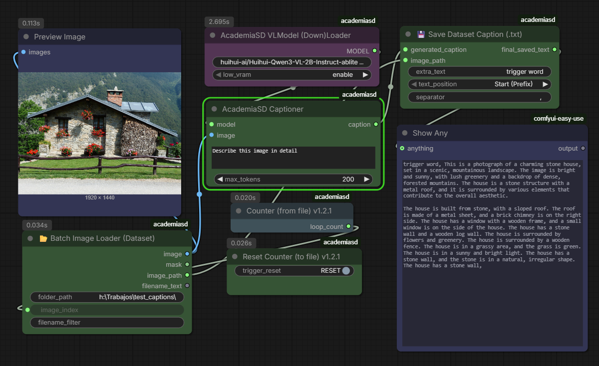
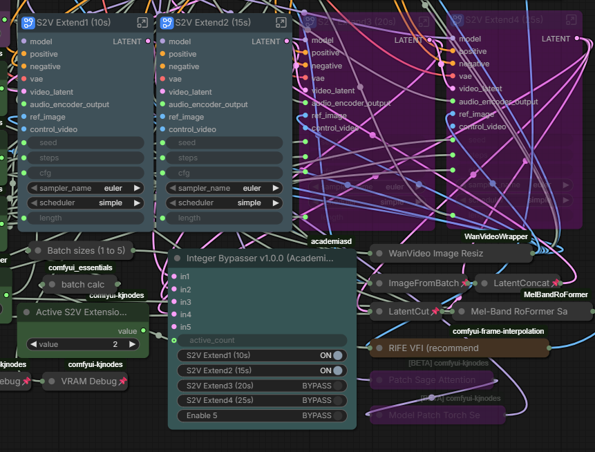
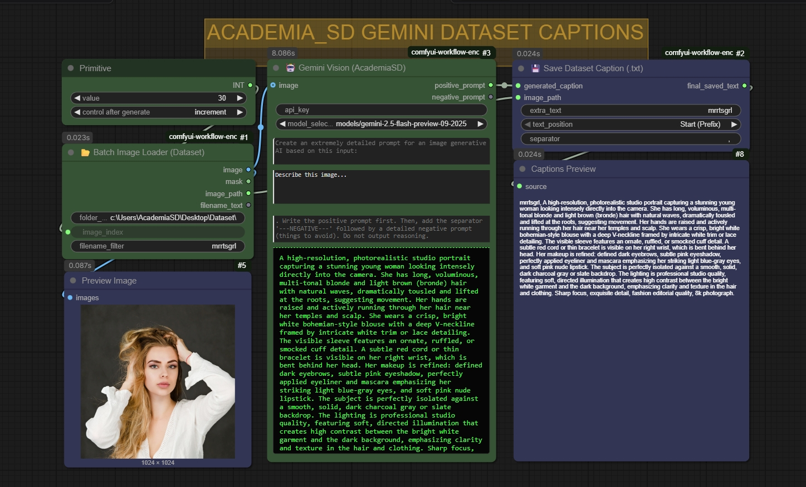

# comfyui_AcademiaSD
# Academia SD Custom Nodes for ComfyUI

A collection of custom nodes designed for **Academia SD**, created to optimize workflows, save downloading time, and improve the user experience (UX) in ComfyUI while maintaining 100% native compatibility.

ComfyUI and ForgeWebUI tutorial in my Youtube channel [@Academia SD](https://www.youtube.com/@Academia_SD)

---

## ⬇️ Academia SD Automatic Downloader v0.99

A smart download manager integrated directly into the ComfyUI canvas.
*   **Multi-Link Support:** Paste links from Civitai or HuggingFace repositories.
*   **Automatic HF Detection:** When pasting a HuggingFace repo link, it automatically displays a dropdown list to choose the exact version (e.g., quantized `.gguf` files).
*   **Cache & Security:** Non-blocking UI. It manages Civitai and HuggingFace tokens to download NSFW or private models, and displays real-time MB/GB weight with progress bars.
*   **Smart Path Management:** Detects your secondary paths in `extra_model_paths.yaml` (e.g., Automatic1111) to avoid downloading the same model twice.

---

## 💊 Academia SD Multi-LoRA v0.8

Load multiple LoRAs in a hyper-compact space without cluttering your workflow with dozens of chained nodes.
*   **Global & Individual Toggles:** Enable or disable LoRAs with a single click for quick testing without disconnecting cables.
*   **On-the-fly Metadata:** Hover your mouse over a LoRA in the menu and a floating *tooltip* will appear showing the base model, training resolution, and the Top 15 Trigger Words.
*   **Agnostic & Native:** Uses ComfyUI's official injection engine. 100% compatible with SD1.5, SDXL, Flux, and complex video architectures. Allows "Model Only" injection to bypass text errors in video models.

---

## 🔢 Academia SD Numeric Input

Dual data converter for maximum compatibility.
*   Enter a single integer value (e.g., `1024`).
*   The node outputs two simultaneous cables: A pure `INT` (`1024`) and a `FLOAT` with decimals (`1024.0`).
*   Avoid using additional converter nodes when connecting the same value to parameters that require strict data types in Python.

---

## 💾🚀 Academia SD Image Save & Send v0.3

End circular connections and easily build cyclic image editing workflows.
*   **Standard Saving:** Safely saves your images in the `output` folder.
*   **"Send to Edit" Button:** Send your rendered image directly to the beginning of the workflow with a single click. When pressed, the node performs a silent copy to the `input/Academia_Edits` folder and instantly refreshes your source `Load Image` node. Perfect for Inpainting and Image-to-Image workflows.

---

## 🖥️ Academia SD Resolution Selector v0.9

Absolute control over resolution with mathematical precision.
*   **Tensor Safety:** Every number entering and leaving this node is mathematically forced to be a multiple of 8, ensuring the generation process doesn't throw errors (Ideal for Flux and LTX-Video).
*   **Quick Controls:** Integrated grid buttons (Half, Double, Swap) to modify the axes without typing.
*   **Get Image Size:** Connect a `Load Image` node to the side cable, press the 📐 button, and the node will automatically adopt the exact resolution of the original image.

---

## Academia SD VL Model Loader (Qwen3-vl) & captions nodes

This set of nodes is designed to automate the process of image captioning and dataset preparation using Vision Language Models (VLM).

### 1. AcademiaSD VLModel (Down)Loader
This node handles the acquisition and initialization of Vision Language Models directly from HuggingFace.
- **Inputs:**
  - `model_repo`: The HuggingFace repository ID (e.g., `huihui-ai/Huihui-Qwen3-VL-2B-Instruct-ablite`).
  - `low_vram`: Toggle to enable memory-efficient loading for GPUs with limited VRAM.
- **Outputs:**
  - `MODEL`: The loaded VLM model ready for inference.

### 2. AcademiaSD Captioner
The core engine for image interrogation. It uses the loaded model to analyze visual content based on a natural language prompt.
- **Inputs:**
  - `model`: Connection to the VLModel Loader.
  - `image`: The image to be analyzed.
  - `prompt`: Text instruction for the model (e.g., "Describe this image in detail").
  - `max_tokens`: Limit for the generated text length.
- **Outputs:**
  - `caption`: A string containing the generated description of the image.

### 3. Batch Image Loader (Dataset)
A specialized loader for dataset management that iterates through local directories.
- **Features:** It expects images to be named with consecutive numbering. You don't need to specify filenames, only the folder path and the current index.
- **Inputs:**
  - `folder_path`: Directory containing your dataset.
  - `image_index`: The specific number of the image to load.
- **Outputs:**
  - `image`: The loaded image tensor.
  - `image_path`: The full path string (essential for synchronization with the saver node).
  - `filename_text`: The name of the file being processed.

### 4. Counter (from file) & Reset Counter
A state-management system to track progress during batch processing.
- **Counter (from file):** Creates and updates a `loops.json` file in the ComfyUI `output` folder. It increments its value by 1 every time the workflow is executed. Perfect for driving the `image_index` of the Batch Loader.
- **Reset Counter (to file):** Contains a `trigger_reset` button that immediately sets the value in `loops.json` back to 0.

### 5. 💾 Save Dataset Caption (.txt)
Automates the creation of sidecar text files for model training datasets.
- **Features:** It uses the path from the Image Loader to ensure the `.txt` file is saved in the same location and with the same name as the image.
- **Inputs:**
  - `generated_caption`: The text from the Captioner.
  - `image_path`: Reference from the Loader to determine the save destination.
  - `extra_text`: Allows adding a "trigger word" or custom tags.
  - `text_position`: Choose if the trigger word appears as a Prefix (Start) or Suffix (End).
  - `separator`: Character used to separate the trigger word from the caption (e.g., a comma).
- **Outputs:**
  - `final_saved_text`: The complete string saved to the disk.

---

## Bypass nodes by value
This node acts as a central control hub to manage the execution state (Active vs. Bypass) of up to 5 connected nodes. It is especially useful for modular workflows where you want to toggle stages on or off dynamically.

- **How it works:**
    - **Manual Control:** You can manually toggle each connected node between `ON` and `BYPASS` using the individual switches in the UI.
    - **Sequential Control (`active_count`):** By connecting an integer to the `active_count` input, you can automate the bypass logic. For example, if `active_count` is set to 3, the first three connected nodes will be activated, and the rest will be bypassed automatically.
- **Features:**
    - **Dynamic Labels:** The switches in the node UI automatically rename themselves based on the title of the nodes connected to the inputs (`in1` to `in5`), making it easy to identify what you are controlling.
- **Inputs:**
    - `in1` to `in5`: Connect the nodes you wish to control here.
    - `active_count`: (Optional) Integer input to determine the number of nodes to keep active sequentially.

Instructions and workflow in the video https://www.youtube.com/watch?v=4Ya_NuEB0Rs

---

## Gemini Vision 1.1.2

Instructions in the video https://www.youtube.com/watch?v=7WJanKUaSEE
Dataset captions included

---

## ⏱️ Academia SD Time Calculator

A pocket-sized, real-time video duration calculator for animation workflows.
*   **Instant Visual Feedback:** Displays the exact video duration in seconds on a sleek, green LED-style digital screen the moment you type or change a value, without needing to run the queue.
*   **Workflow Integration:** Outputs the `FRAMES` (INT) and `FPS` (FLOAT) values so you can plug them directly into your Video Samplers or Video Combine nodes. Use it as your unified master control for video length!
*   **Decimal FPS Support:** Fully supports standard animation and cinematic framerates like `23.9` or `29.97` FPS.
*   **Ultra-Compact Design:** Meticulously designed to take up the absolute minimum space on your canvas (down to 180px width), making it the perfect, unobtrusive sidekick for your LTX-Video or Stable Video Diffusion setups.

# Workflows included.
