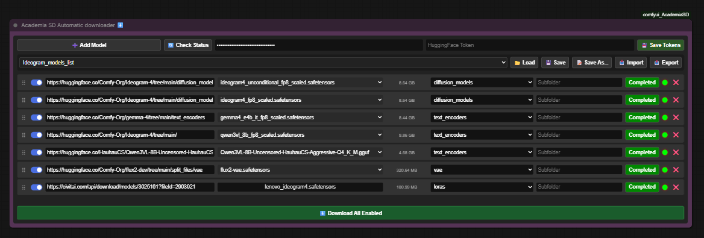
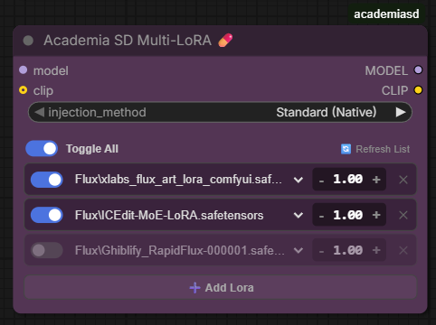
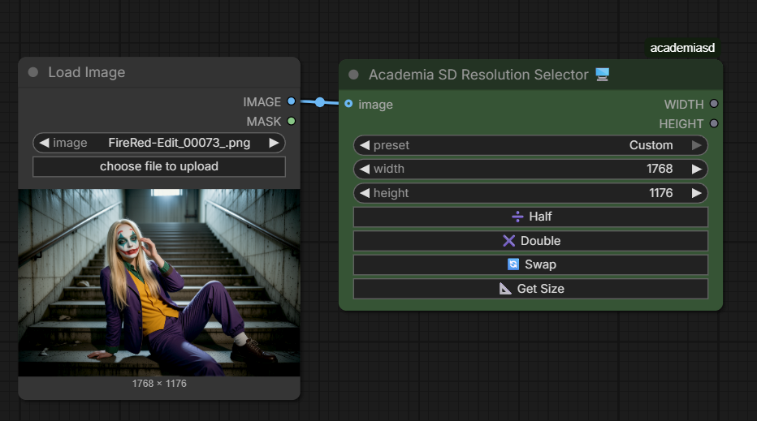

# comfyui_AcademiaSD
# Academia SD Custom Nodes for ComfyUI

A collection of custom nodes designed for **Academia SD**, created to optimize workflows, save downloading time, and improve the user experience (UX) in ComfyUI while maintaining 100% native compatibility.

ComfyUI and ForgeWebUI tutorial in my Youtube channel [@Academia SD](https://www.youtube.com/@Academia_SD)

Loop Tools
Instructions in the video https://www.youtube.com/watch?v=vACeuxv5HIw

Bypass nodes by value
Instructions in the video https://www.youtube.com/watch?v=4Ya_NuEB0Rs

Gemini Vision 1.1.2
Instructions in the video https://www.youtube.com/watch?v=7WJanKUaSEE
Dataset captions included

## ⬇️ Academia SD Automatic Downloader v0.99

A smart download manager integrated directly into the ComfyUI canvas.
*   **Multi-Link Support:** Paste links from Civitai or HuggingFace repositories.
*   **Automatic HF Detection:** When pasting a HuggingFace repo link, it automatically displays a dropdown list to choose the exact version (e.g., quantized `.gguf` files).
*   **Cache & Security:** Non-blocking UI. It manages Civitai and HuggingFace tokens to download NSFW or private models, and displays real-time MB/GB weight with progress bars.
*   **Smart Path Management:** Detects your secondary paths in `extra_model_paths.yaml` (e.g., Automatic1111) to avoid downloading the same model twice.

## 💊 Academia SD Multi-LoRA v0.7

Load multiple LoRAs in a hyper-compact space without cluttering your workflow with dozens of chained nodes.
*   **Global & Individual Toggles:** Enable or disable LoRAs with a single click for quick testing without disconnecting cables.
*   **On-the-fly Metadata:** Hover your mouse over a LoRA in the menu and a floating *tooltip* will appear showing the base model, training resolution, and the Top 15 Trigger Words.
*   **Agnostic & Native:** Uses ComfyUI's official injection engine. 100% compatible with SD1.5, SDXL, Flux, and complex video architectures. Allows "Model Only" injection to bypass text errors in video models.

Numeric to Int&Float 

Image Save & Send

## Academia SD Resolution Selector for ComfyUI v0.9

A utility node for ComfyUI designed to make image resolution management fast, precise, and user-friendly. Whether you are working with SDXL or SD 1.5 models, this node provides a clean interface to calculate and set your dimensions.

## Features

- **Quick Presets:** Easily select common resolutions for SDXL/SD 1.5 with a single click.
- **Manual Control:** Full control over width and height with built-in validation (rounds to the nearest multiple of 8 to ensure model compatibility).
- **Workflow Utilities:**
    - **Half (➗):** Quickly halve the resolution.
    - **Double (✖️):** Quickly double the resolution.
    - **Swap (🔄):** Instantly swap width and height.
    - **Get Size (📐):** A unique feature that reads the dimensions of an input image (from a `Load Image` node) and automatically updates the Width and Height widgets.
- **Smart State:** If you manually edit the width or height, the preset selector automatically switches to "Custom," keeping your workflow organized.

# Workflows included.
