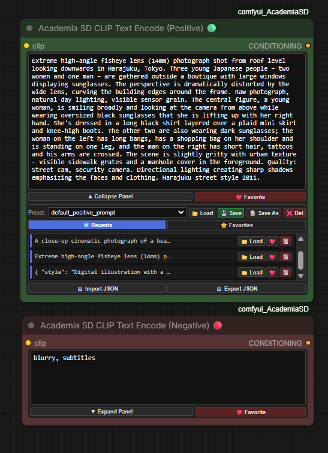
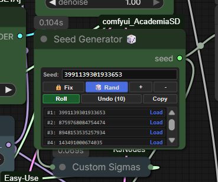
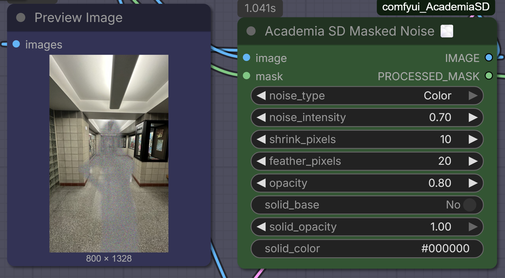
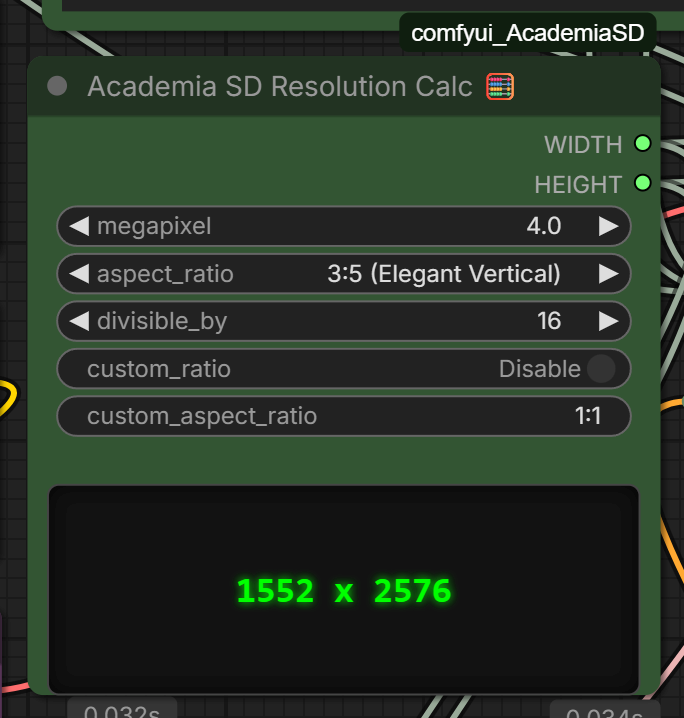
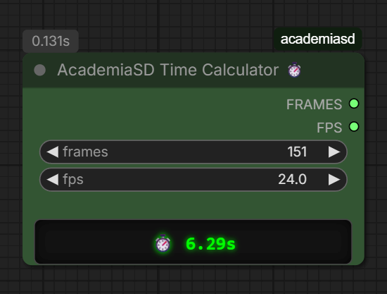
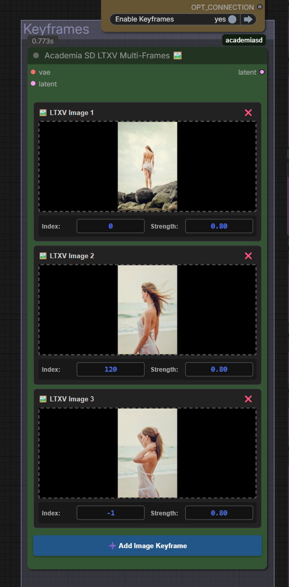

# comfyui_AcademiaSD
# Academia SD Custom Nodes for ComfyUI

A collection of custom nodes designed for **Academia SD**, created to optimize workflows, save downloading time, and improve the user experience (UX) in ComfyUI while maintaining 100% native compatibility.

ComfyUI and ForgeWebUI tutorial in my Youtube channel [@Academia SD](https://www.youtube.com/@Academia_SD)

---

## Academia SD Automatic Downloader for ComfyUI ⬇️ v1.02

A highly integrated download manager designed for ComfyUI. Download checkpoints, LoRAs, VAEs, and other models directly inside your workspace without leaving the canvas.

This tool scans your ComfyUI directories (including secondary paths defined in `extra_model_paths.yaml`) to verify existing models, manages downloads in non-blocking background threads, and handles authorization tokens for private or gated models on Civitai and HuggingFace.

## Key Features

*   **⚡ Non-Blocking Background Downloads:** Downloading large models does not freeze ComfyUI. The application runs downloads in secondary threads.
*   **🔄 Dual Platform Support:** Paste direct download URLs from **Civitai** or **HuggingFace**.
*   **📦 Automatic HuggingFace Repository Parsing:** When pasting a HuggingFace repository link, it automatically fetches and displays a dropdown list of available model files (e.g., `.safetensors`, `.gguf`, `.ckpt`).
*   **💾 Local Duplicate Detection:** Automatically checks if the file already exists in your local folders or shared directories (e.g., Automatic1111/Forge) using ComfyUI’s path resolution system.
*   **🔒 Gated & Private Model Support:** Securely save your Civitai API Keys and HuggingFace Tokens to download restricted, NSFW, or private files.
*   **📁 Custom Subfolders:** Define subfolder paths dynamically (e.g., download a LoRA directly into `loras/style/anime/`).
*   **📑 Presets Management:** Save your favorite model lists, export them as JSON, or import shared lists from other users.
*   **🧬 Visual Drag & Drop Reordering:** Organize your download queue by dragging and dropping items within the node.

## Status Indicators (LEDs)

Each model row features a real-time status light:
*   🟢 **Green:** Model is already downloaded and present in your folders.
*   🟡 **Yellow:** Download in progress (displays a real-time progress percentage).
*   🔴 **Red:** Model is not found locally. Ready to download.
*   🟣 **Magenta:** API Token required to access this file.
*   🟠 **Orange:** Actively communicating with the server / Checking status.

---
## Academia SD Advanced CLIP Text Encode (Positive & Negative) 🟢🔴

An ultra-sleek, highly responsive custom CLIP Text Encode implementation for ComfyUI. Designed to act as a direct, drop-in replacement for the native CLIP Text Encode node, it introduces a dynamic, collapsible utility tray for managing prompt history, favorites, and custom prompt lists—all while maintaining an incredibly small, pixel-perfect footprint on your canvas.

# Key Features

*   **📐 Fluid Responsive Layout (`flex: 1`):** The primary prompt text area utilizes a fully fluid layout. Stretch, widen, or scale the node manually in any direction; the editor box will dynamically expand to fill 100% of the available vertical space.
*   **🧠 Independent State Sizing (Size Memory):** The node intelligently remembers your manually adjusted dimensions separately for *both* collapsed and expanded modes. Toggling between them fluidly snaps the node to your preferred width and height without resetting or forcing generic dimensions.
*   **🧹 Zero-Overlap DOM Injection:** Completely isolates and overrides ComfyUI's native multiline `<textarea>` element at the DOM level (`display: none !important`). This guarantees no duplicate text render overlays, no layout breaks, and a clean interface from the millisecond the node is spawned.
*   **⏪ Auto-Queueing Recent Prompts (Last 10):** Generates and keeps a real-time rolling list (FIFO) of your last 10 queued prompts. Duplicate entries are automatically cleaned up and pushed to the top.
*   **❤️ Favorites Vault:** Save your absolute best prompts directly to a dedicated Favorites list by clicking the heart button. They are styled as independent cards with quick-action utilities to load or delete them.
*   **📂 Multi-Preset Saving & Loading:** Create custom preset files (e.g., `landscapes.json`, `portraits.json`). Supports saving, creating copies (`Save As`), and deleting presets directly from the node.
*   **⚡ Default File Auto-Loading:** 
    *   The **Positive Node** automatically loads `default_positive_prompt.json` on startup.
    *   The **Negative Node** automatically loads `default_negative_prompt.json` on startup.
*   **📤 Import / Export JSON:** Easily import custom prompt libraries or backup your favorites lists to standard JSON files.

# Interface Layout & Sizing Bounds

*   **Collapsed (Compact) Mode (Height: `120px`):** Shows only the active prompt box and the control bar. Completely hides the lists to keep your canvas clear.
*   **Expanded Mode (Height: `>= 275px`):** Reveals preset controls, tab selectors, scrollable card lists, and file utilities.
*   **Minimum Width:** Locked at `420px` to maintain pristine, legible button alignments.

# Folder Structure

All prompt list files are stored locally within your custom node directory.
custom_nodes/comfyui_AcademiaSD/prompt_lists/

---

## Academia SD Advanced Seed Generator for ComfyUI 🎲

An ultra-compact, high-performance seed generator node built specifically for ComfyUI. Designed to replace the native, pixel-perfect HTML interface that minimizes canvas clutter while introducing advanced seed history management.

# Key Features

*   **📐 Extreme Space Compression:** Measures only `230px` in width with a dynamically adjusting height. It sits snug right below the title bar, aligning your primary input rows directly with the `seed` output connector to eliminate wasted empty space.
*   **⏪ Pure Non-Destructive Undo:** Safely backtrack through your seed history queue (up to the last 10 seeds) without shifting index arrays in real time. Perfect for recovering that one specific generation you accidentally skipped.
*   **📋 Interactive History Tray:** Displays a visual panel list containing your last 10 seeds. Hovering and clicking any seed instantly loads it back into active status and locks the mode to "Fixed".
*   **🎲 Fast "Roll" Action:** Instantly roll a new random seed on-the-fly directly inside the node widget without needing to queue a new generation prompt.
*   **🔒 Standard & Advanced Generation Modes:**
    *   `🔒 Fix`: Locks the active seed.
    *   `🎲 Rand`: Automatically rolls a new seed on every queue execution.
    *   `➕ Increment`: Increments the active seed value by `+1` on every generation.
    *   `➖ Decrement`: Decrements the active seed value by `-1` on every generation.
*   **🧹 Built-in Interface Cleanup:** Robust frontend cleaning algorithms actively remove ComfyUI's native duplicates, hidden input sockets, or extra output connectors. Only one clean, highly-compatible output port (`seed`) remains visible.
*   **💾 Session Serialization:** All seed history and configuration states are serialized natively. Your history persists even after saving, closing, or reloading your ComfyUI workflow JSON.

# Interface Layout & Button Controls

| Element | Description |
| :--- | :--- |
| **Seed Input** | A monospace text field displaying the active seed. Supports manual numerical entry (safe range up to `9007199254740991`). |
| **🔒 Fix** | Locks the current seed so it remains unchanged during generation. |
| **🎲 Rand** | Generates a new randomized seed automatically when queuing a prompt. |
| **➕ / ➖** | Increments or decrements the current seed value automatically when queuing a prompt. |
| **Roll** | Generates a new random seed instantly and locks the mode to `🔒 Fix`. |
| **Undo (X)** | Steps backward through your local seed history sequentially. |
| **Copy** | Copies the active seed value to your clipboard with temporary visual feedback. |
| **History Panel** | An expandable bottom tray that opens automatically when history items exist. Click any row to reload a past seed. |

---

# 💊 Academia SD Multi-LoRA v0.8

Load multiple LoRAs in a hyper-compact space without cluttering your workflow with dozens of chained nodes.
*   **Global & Individual Toggles:** Enable or disable LoRAs with a single click for quick testing without disconnecting cables.
*   **On-the-fly Metadata:** Hover your mouse over a LoRA in the menu and a floating *tooltip* will appear showing the base model, training resolution, and the Top 15 Trigger Words.
*   **Agnostic & Native:** Uses ComfyUI's official injection engine. 100% compatible with SD1.5, SDXL, Flux, and complex video architectures. Allows "Model Only" injection to bypass text errors in video models.

---

## 🔢 Academia SD Numeric Input

Dual data converter for maximum compatibility.
*   Enter a single integer value (e.g., `1024`).
*   The node outputs two simultaneous cables: A pure `INT` (`1024`) and a `FLOAT` with decimals (`1024.0`).
*   Avoid using additional converter nodes when connecting the same value to parameters that require strict data types in Python.

---

## 💾🚀 Academia SD Image Save & Send v0.3

End circular connections and easily build cyclic image editing workflows.
*   **Standard Saving:** Safely saves your images in the `output` folder.
*   **"Send to Edit" Button:** Send your rendered image directly to the beginning of the workflow with a single click. When pressed, the node performs a silent copy to the `input/Academia_Edits` folder and instantly refreshes your source `Load Image` node. Perfect for Inpainting and Image-to-Image workflows.

---

## 🖥️ Academia SD Resolution Selector v0.9

Absolute control over resolution with mathematical precision.
*   **Tensor Safety:** Every number entering and leaving this node is mathematically forced to be a multiple of 8, ensuring the generation process doesn't throw errors (Ideal for Flux and LTX-Video).
*   **Quick Controls:** Integrated grid buttons (Half, Double, Swap) to modify the axes without typing.
*   **Get Image Size:** Connect a `Load Image` node to the side cable, press the 📐 button, and the node will automatically adopt the exact resolution of the original image.

---

## Academia SD VL Model Loader (Qwen3-vl) & captions nodes

This set of nodes is designed to automate the process of image captioning and dataset preparation using Vision Language Models (VLM).

### 1. AcademiaSD VLModel (Down)Loader
This node handles the acquisition and initialization of Vision Language Models directly from HuggingFace.
- **Inputs:**
  - `model_repo`: The HuggingFace repository ID (e.g., `huihui-ai/Huihui-Qwen3-VL-2B-Instruct-ablite`).
  - `low_vram`: Toggle to enable memory-efficient loading for GPUs with limited VRAM.
- **Outputs:**
  - `MODEL`: The loaded VLM model ready for inference.

### 2. AcademiaSD Captioner
The core engine for image interrogation. It uses the loaded model to analyze visual content based on a natural language prompt.
- **Inputs:**
  - `model`: Connection to the VLModel Loader.
  - `image`: The image to be analyzed.
  - `prompt`: Text instruction for the model (e.g., "Describe this image in detail").
  - `max_tokens`: Limit for the generated text length.
- **Outputs:**
  - `caption`: A string containing the generated description of the image.

### 3. Batch Image Loader (Dataset)
A specialized loader for dataset management that iterates through local directories.
- **Features:** It expects images to be named with consecutive numbering. You don't need to specify filenames, only the folder path and the current index.
- **Inputs:**
  - `folder_path`: Directory containing your dataset.
  - `image_index`: The specific number of the image to load.
- **Outputs:**
  - `image`: The loaded image tensor.
  - `image_path`: The full path string (essential for synchronization with the saver node).
  - `filename_text`: The name of the file being processed.

### 4. Counter (from file) & Reset Counter
A state-management system to track progress during batch processing.
- **Counter (from file):** Creates and updates a `loops.json` file in the ComfyUI `output` folder. It increments its value by 1 every time the workflow is executed. Perfect for driving the `image_index` of the Batch Loader.
- **Reset Counter (to file):** Contains a `trigger_reset` button that immediately sets the value in `loops.json` back to 0.

### 5. 💾 Save Dataset Caption (.txt)
Automates the creation of sidecar text files for model training datasets.
- **Features:** It uses the path from the Image Loader to ensure the `.txt` file is saved in the same location and with the same name as the image.
- **Inputs:**
  - `generated_caption`: The text from the Captioner.
  - `image_path`: Reference from the Loader to determine the save destination.
  - `extra_text`: Allows adding a "trigger word" or custom tags.
  - `text_position`: Choose if the trigger word appears as a Prefix (Start) or Suffix (End).
  - `separator`: Character used to separate the trigger word from the caption (e.g., a comma).
- **Outputs:**
  - `final_saved_text`: The complete string saved to the disk.

---

## Bypass nodes by value
This node acts as a central control hub to manage the execution state (Active vs. Bypass) of up to 5 connected nodes. It is especially useful for modular workflows where you want to toggle stages on or off dynamically.

- **How it works:**
    - **Manual Control:** You can manually toggle each connected node between `ON` and `BYPASS` using the individual switches in the UI.
    - **Sequential Control (`active_count`):** By connecting an integer to the `active_count` input, you can automate the bypass logic. For example, if `active_count` is set to 3, the first three connected nodes will be activated, and the rest will be bypassed automatically.
- **Features:**
    - **Dynamic Labels:** The switches in the node UI automatically rename themselves based on the title of the nodes connected to the inputs (`in1` to `in5`), making it easy to identify what you are controlling.
- **Inputs:**
    - `in1` to `in5`: Connect the nodes you wish to control here.
    - `active_count`: (Optional) Integer input to determine the number of nodes to keep active sequentially.

Instructions and workflow in the video https://www.youtube.com/watch?v=4Ya_NuEB0Rs

---

## Gemini Vision 1.1.2

Instructions in the video https://www.youtube.com/watch?v=7WJanKUaSEE
Dataset captions included

---

## Academia SD Masked Noise

Add cinematic film grain and organic noise exclusively to specific areas of your image using a mask.
*   **True Additive Noise:** Unlike nodes that just fade your image into a static picture, this node uses additive mathematics. The `noise_intensity` slider softens or sharpens the grain structure without making it transparent, preserving the full opacity of the effect over your image.
*   **Solid Base Generator:** Optionally apply a solid background color underneath the noise. Includes an interactive color picker with an eyedropper tool and an independent `solid_opacity` slider to give your noise masks volume and presence over complex backgrounds.
*   **Dual Noise Generation:** Choose between chromatic digital grain (`Color`) or classic cinematic film grain (`Black & White`).
*   **Mask Adjustments on the Fly:** Forget external masking nodes. Includes built-in sliders to shrink the mask away from edges (`shrink_pixels`) and apply professional Gaussian edge-blurring (`feather_pixels`) for seamless transitions.
*   **Master Opacity & Mask Output:** Use the global `opacity` slider to fine-tune how strongly the final masked effect blends into your composition. It also outputs a secondary `PROCESSED_MASK` cable, allowing you to route the perfectly feathered and shrunk mask directly into your Inpainting or ControlNet pipelines.

---

## 🧮 Academia SD Resolution Calc

A modern resolution calculator tailored for Megapixel-based models (like SDXL and Flux).
*   **Megapixel-Driven:** Instead of guessing widths and heights, set your target Megapixels (e.g., `1.0` for SDXL or `2.0` for Flux) and let the node do the complex math.
*   **Extensive Ratio Library:** Comes pre-loaded with an exhaustive list of cinematic and standard aspect ratios (from `1:1 Perfect Square` up to `32:9 Extreme Ultrawide`).
*   **Custom Ratio Override:** Enable the `custom_ratio` switch to type any exotic aspect ratio (e.g., `14:9`) on the fly.
*   **Divisibility Safety:** Easily lock the output to be strictly divisible by `8`, `16`, `32`, or `64` to prevent tensor dimension errors during inference.
*   **Real-time LED Screen:** Instantly preview the exact mathematically calculated `width` and `height` in a sleek green display as you change settings, without needing to queue a prompt. Outputs standard `INT` variables ready to connect to your Empty Latent nodes.
  
---

## ⏱️ Academia SD Time Calculator

A pocket-sized, real-time video duration calculator for animation workflows.
*   **Instant Visual Feedback:** Displays the exact video duration in seconds on a sleek, green LED-style digital screen the moment you type or change a value, without needing to run the queue.
*   **Workflow Integration:** Outputs the `FRAMES` (INT) and `FPS` (FLOAT) values so you can plug them directly into your Video Samplers or Video Combine nodes. Use it as your unified master control for video length!
*   **Decimal FPS Support:** Fully supports standard animation and cinematic framerates like `23.9` or `29.97` FPS.
*   **Ultra-Compact Design:** Meticulously designed to take up the absolute minimum space on your canvas (down to 180px width), making it the perfect, unobtrusive sidekick for your LTX-Video or Stable Video Diffusion setups.

---

## 🖼️ Academia SD LTXV Multi-Frames

An all-in-one, cable-free image injector designed specifically for LTX-Video Image-to-Video workflows.
*   **Drag & Drop Interface:** Upload and manage multiple reference images directly inside the node's UI. No need for messy `Load Image` nodes cluttering your workspace.
*   **Smart Indexing:** Automatically sets the first frame to index `0` and newly added frames to `-1` (last frame by default), keeping your animation loops mathematically sound.
*   **Per-Frame Strength Control:** Precisely adjust the injection strength for each individual keyframe to guide the video generation.
*   **In-Place Latent Injection:** Encodes and injects the images directly into the latent space and noise mask, perfectly conditioning the LTX-Video architecture without external spaghetti wiring.

> **Acknowledgments:** The core latent injection and masking logic of this node is built upon the fantastic work from [Kijai's ComfyUI-LTXVideo](https://github.com/kijai/ComfyUI-LTXVideo) wrapper (specifically adapted from the `LTXVImgToVideoInplaceKJ` node).

---

# Workflows included.
